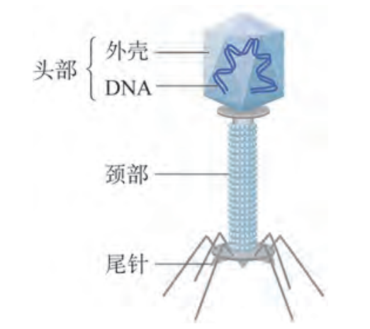
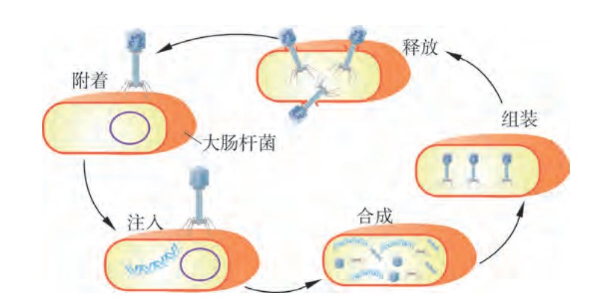
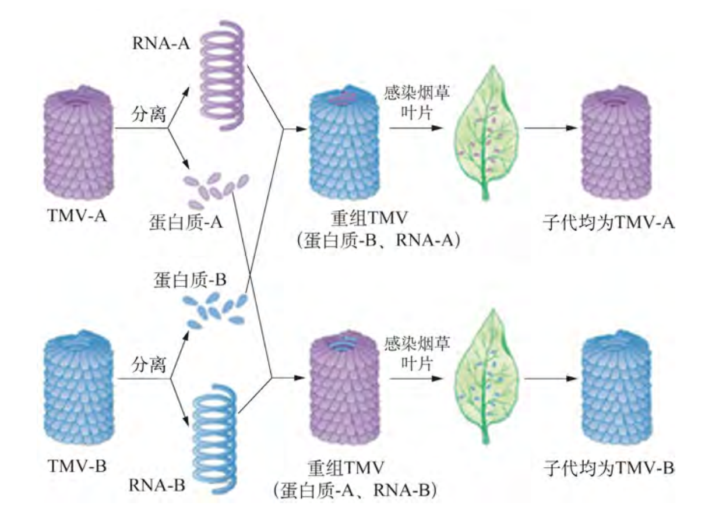

# DNA 是主要的遗传物质

## 格里菲斯的肺炎链球菌体内转化实验

1928 年，英国科学家**格里菲斯**进行肺炎链球菌**体内**转化实验。

两种肺炎链球菌类型：

- S 型细菌，有多糖类荚膜，菌落表面光滑，**有毒性**。
- R 型细菌，无多糖类荚膜，菌落表面粗糙，**无毒性**。

四种实验：

1. 感染 R 菌后，小鼠未死亡；
2. 感染 S 菌后，小鼠**死亡**；
3. 感染经加热灭活后的 S 菌后，小鼠未死亡；
4. 感染 R 菌与灭活后的 S 菌混合物， 小鼠**死亡**；并在死亡小鼠体内检测到活的 S 菌。

结论：格里菲斯认为，有某种化学物质从加热灭活的 S 菌中进入了活的 R 菌，从而使得 R 菌具有了 S 菌“使小鼠致死”的性状，他将这种物质称为“**转化因子**”。

（加热杀死 S 型细菌后，**蛋白质变形失活**，DNA 在加热过程中，双螺旋解开，但冷却后**可恢复结构**）

## 艾弗里的肺炎链球菌体外转化实验

1944 年，美国科学家**艾弗里**进行肺炎链球菌**体外**转化实验，将 S 菌裂解，提取出其中物质，分别与 R 菌混合，观察哪种物质能使 R 菌转化成 S 菌。

实验结果：

- S 菌的 DNA 可以使少数 R 菌转化为 S 菌；
- S 菌的 DNA 与 DNA 酶（可以降解 DNA）、蛋白质、荚膜多糖、RNA 都不能使 R 菌转化为 S 菌。

结论：“转化因子”不是蛋白质而是 DNA。

该实验**首次证明了 DNA 可作为遗传物质，蛋白质不是遗传物质**。

## 赫尔希和蔡斯的 T2 噬菌体实验

1952 年，美国科学家**赫尔希和蔡斯**以 **T2 噬菌体**为原料，利用**放射性同位素标记技术**，证明 DNA 是遗传物质。

{ .center width="192" }

**T2 噬菌体**是一种 DNA 病毒，化学成分为**蛋白质和 DNA**，可寄生在**大肠杆菌**体内。 

{ .center width="512" }

实验时，使用不同同位素标记噬菌体后，分别侵染不含放射性同位素的大肠杆菌，然后进行**搅拌**，通过离心分离成**上清液（噬菌体外壳）**和**沉淀物（被侵染的大肠杆菌细胞）**。

使用放射性同位素标记噬菌体**方式**：

- 分别使用含有 $^{35}\ce{S}, ^{32}\ce{P}$ 的培养基培养大肠杆菌；
- 使用 T2 噬菌体分别侵染使用上述培养基培养的大肠杆菌，以标记噬菌体。

实验结论：

- 当使用 $^{35}\ce{S}$ 标记噬菌体时，大肠杆菌几乎无放射性。
- 当使用 $^{32}\ce{P}$ 标记噬菌体时，放射性集中在大肠杆菌细胞内。
- 说明噬菌体在侵染时，DNA 进入细菌，蛋白质留在细菌外，因此证明 T2 噬菌体的遗传物质时是 DNA。
- **并没有证明蛋白质**不是 T2 噬菌体的遗传物质，因为蛋白质没有进入大肠杆菌细胞中。

补充：

- 使用 $^{35}\ce{S}, ^{32}\ce{P}$ 的原因：$\ce{P}$ 是噬菌体 DNA 特有的元素；$\ce{S}$ 是噬菌体蛋白质特有的元素。
- 放射性检测的时候只能检测到放射性存在部位，不能区分是哪种元素带来的放射性。 

## 烟草花叶病毒侵染烟草实验（RNA）

烟草花叶病毒 TMV 是一种 RNA 病毒，只含有 RNA 和蛋白质，烟草感染后会形成病斑。

1955 年，美国科学家弗伦克尔-康拉特和威廉姆斯从 A,B 两种类型 TMV 中分离蛋白质和 RNA，重组后去感染烟草，鉴别其类型。

实验结论：TMA 的遗传物质是 RNA。

{ .center width="512" }

---

最终，明确了**绝大多数生物的遗传物质是 DNA，RNA 病毒的遗传物质是 RNA**。