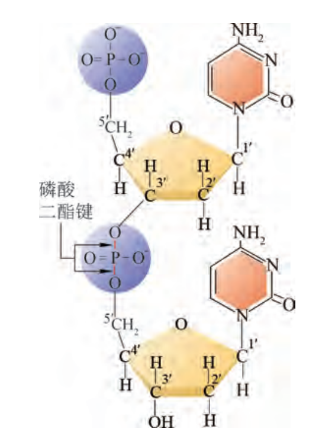
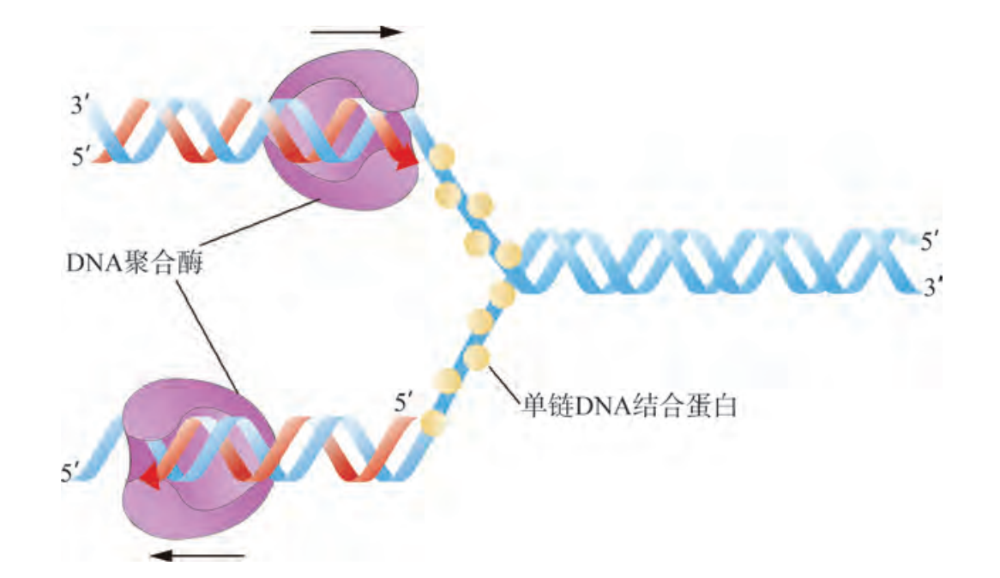

# DNA 的结构与复制

## 绝大多数生物的遗传信息蕴含在 DNA 结构中

DNA：

元素组成：$\ce{C,H,O,N,P}$。

基本结构单位：脱氧核糖核苷酸：
- 分为磷酸基团、脱氧核糖、碱基（**腺嘌呤 A，鸟嘌呤 G，胞嘧啶 C，胸腺嘧啶 T**）三部分。
  
基本骨架：
- 脱氧核糖上有 5 个碳原子，依次编号为 1' 到 5'，相邻的脱氧核糖通过 **5' 碳到 3' 碳**之间的**磷酸二酯键**相连，成为 DNA 单链的基本骨架。
- 方向：一个 5'，一个 3' 没有形成磷酸二酯键，按照国际惯例，书写 DNA 单链碱基顺序时，以左端表示 5' 端。
- **沃森和克里克**提出双螺旋结构模型：DNA 分子两条单链虽然是平行的，但走向是**双螺旋结构**。两条单链反向平行。
- 碱基连在 1' 碳上，遵循互补配对原则：
  - A,T 配对，形成 **2 个氢键**；
  - C,G 配对，形成 **3 个氢键**。
- 人类细胞核中 DNA 约含有 60 亿碱基对（bp），最长的一条 DNA 分子多达 2.5 亿个碱基对。生物的遗传信息就是以碱基序列的形式存储在 DNA 分子中。

{ .center width="256" }

## DNA 半保留复制

以亲代 DNA 为模板合成子代 DNA 的过程。

DNA 复制过程：

1. **DNA 解旋酶**（断开碱基之间氢键使双链打开，需要 ATP 供能）从**复制起点**处打开双链间氢键，使部分双链解开，形成两条单链，作为复制母链。
2. **单链 DNA 结合蛋白**像“楔子”一样结合在单链上，防止单链再次结合为双链。
3. **DNA 聚合酶**和其它一些特定蛋白被招募到 DNA 上，以两条打开的母链为模板，以四种**脱氧核糖核苷三磷酸**为原料，遵循**碱基互补配对原则**，**从 5' 到 3' 方向**合成新生链。复制过程中，**边解旋边复制，多起点复制，双向复制**。

时间：真核生物中，发生在细胞分裂前的间期。

地点：真核生物中，发生在细胞质内（线粒体、叶绿体内也可进行）；原核生物发生在拟核中，细胞质内也可进行。

DNA 复制具有高度保真性，错误率只有 $10^{-8}$ 甚至更低，保持了遗传稳定性。

复制过程中一条单链来自母链，一条新合成，因此称为**半保留复制**。

{ .center width="256" }

实验证明（梅塞尔森、斯塔尔）：

- 大肠杆菌在只在 $^{15}\ce{N}$ 的 $\ce{NH4Cl}$ 作为唯一氮源的培养基中生长若干代；
- 转移到只含 $^{14}\ce{N}$ 培养基中继续生长，每代（约 20 分钟）分别提取 DNA，测量两种同位素的比例。

## DNA 转录为 RNA