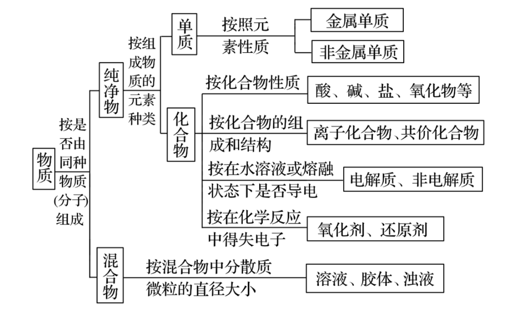
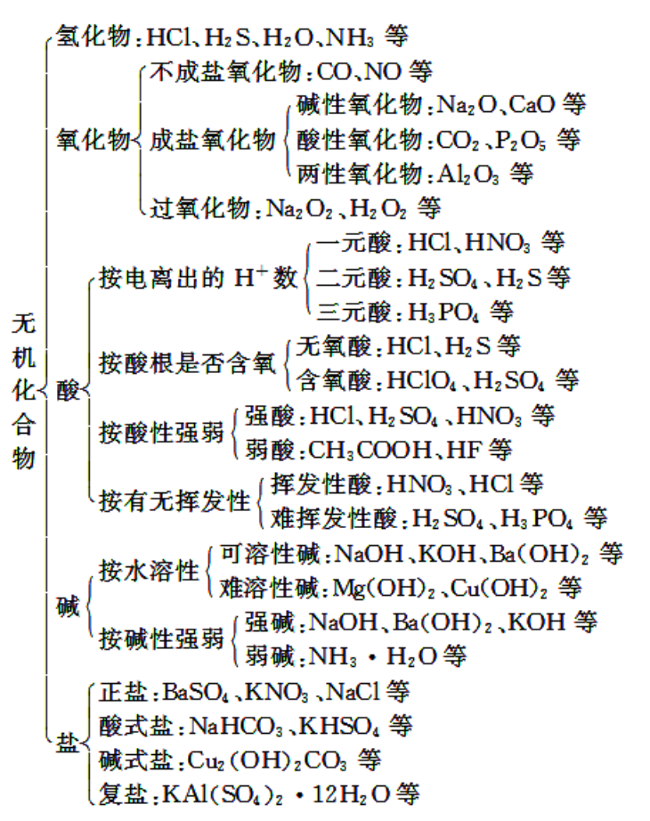

# 物质的组成、性质和分类

## 物质的组成

宏观上物质是由元素**组成**的，微观上物质是由微观粒子**构成**的。

- 分子：保持物质**化学性质**的最小微粒。
- 原子：化学变化中的最小微粒。
- 离子：带电荷的原子/原子团。
- 原子团：在许多化学反应里，作为一个整体参加反应，如同一个原子一样的原子集团。

| | 划分角度 | 是否带电 | 能否独立存在 | 例子 |
|---|---|---|---|---|
| 基 | 电子状态（带单电子） | 电中性 | 不能，只在分子中 | —CH₃、—CH₂—、—OH |
| 官能团 | 功能（决定特性） | 电中性 | 不能 | —OH、—CHO、—COOH |
| 原子团 | 组成（多原子集团） | **可带电** | 带电时能（即离子） | SO₄²⁻、NH₄⁺、OH⁻ |

元素：具有相同核电荷数的一类原子的总称。元素在自然界中存在形态：

- 游离态：以单质形式存在。
- 化合态：以化合物形式存在。
- 单质：只有一种元素组成的纯净物。
- 化合物：有多种元素组成的纯净物。

混合物和纯净物：

- 纯净物：由同种单质或化合物组成的物质。
- 混合物：由几种不同的单质或化合物组成的物质。
- **结晶水合物、同位素形成的单质化合物**属于纯净物。
- 纯净物和混合物的区别

| 纯净物 | 混合物 |
|---|---|
| 有固定的组成和结构 | 无固定的组成和结构 |
| 有一定的熔、沸点 | 无一定的熔、沸点 |
| 保持一种物质的性质 | 保持原有物质各自的性质 |

同素异形体：同种元素形成的**不同单质**。

- 形成方式：原子个数不同/原子排列方式不同。
- 物理性质差别较大，**化学性质相似**。
- 只含一种元素的物质不一定是单质。

## 物质的分类

1. 交叉分类法：从不同角度对物质进行分类。
2. 树状分类法：明确分类标准。

{ .center width="400" }

{ .center width="400" }

## 物质的三态

- 固体：有一定的形状，不易被压缩，微粒能够做微小震动。
- 液体：没有固定的形状，有固定体积，不易被压缩，微粒之间可以滑行或滑动。
- 气体：没有固定的形状体积，易被压缩，微粒向任何方向快速移动，撞击容器壁产生压强。
- 相互转化：熔化/凝固、汽化/液化、升华/凝华。
- 固体和液体也被称为物质的凝聚态。
- 等离子体：由电荷总数相等的正离子和自由电子构成的电离状态的气体。
- （**电离**：原子外层电子具有足够的能量而摆脱原子核的束缚，成为自由电子）。

## 氧化物

酸性氧化物：

- 能与**碱**反应生成**盐和水**的氧化物。
- 例子：$\ce{CO2,SO2,SO3,P2O5,SiO2,Mn2O7}$。
- 大多数酸性氧化物能与水直接化合生成对应的酸（$\ce{SiO2}$ 除外，不溶于水）。
- $\ce{NO2}$ 不是酸性氧化物： $\ce{2NO2 +2NaOH\xlongequal{}NaNO3 + NaNO2 + H2O}$，发生氧化还原反应。

碱性氧化物：

- 能与酸反应生成盐和水的氧化物。
- 例子： $\ce{Na2O,CaO,MgO,Fe2O3,CuO}$。
- 活泼金属的氧化物能与水直接化合生成对应的碱；不活泼金属的氧化物不溶于水，但溶于酸。
- **所有碱性氧化物都是金属氧化物**。

两性氧化物：

- 既能与酸反应、又能与碱反应生成盐和水的氧化物。
- 例子：$\ce{Al2O3,ZnO}$。
- $\ce{Al2O3 + 6HCl \xlongequal{} 2AlCl3 + 3H2O}$ 表现碱性氧化物性质。
- $\ce{Al2O3 + 2NaOH \xlongequal{} 2NaAlO2 + H2O}$ 表现酸性氧化物性质，$\ce{NaAlO2}$ 与 $\ce{Na[Al(OH)4]}$ 本质相同。

不成盐氧化物：

- 既不能与酸反应、又不能与碱反应生成盐和水的氧化物。
- 例子：$\ce{CO,NO,NO2}$。

过氧化物：

- 含有过氧键的氧化物，其中氧元素为 $-1$ 价。
- 例子：$\ce{Na2O2,H2O2}$。
- 与酸反应时生成盐和水还会生成氧气，所以不是碱性氧化物。也不是不成盐氧化物。

补充：
- 酸性氧化物、碱性氧化物不一定都能与水反应生成相应的酸、碱（如 $\ce{SiO2,Fe2O3}$ 不与水反应）。
- 酸性氧化物都是对应酸的**酸酐**（某含氧酸脱去一分子水或几分子水，所剩下的部分），但酸酐不一定都是酸性氧化物。
- 溶于水生成酸的氧化物不一定是酸性氧化物（如 $\ce{NO2}$）。

## 常见的混合物

气体混合物：

- 空气（$78\% \ce{N2},21\% \ce{O2}$，稀有气体，水蒸气，二氧化碳等）
- 水煤气（$\ce{CO,H2}$，由 $\ce{C+H2O->[高温]CO+H2}$ 制得，气体燃料）
- 天然气（主要为甲烷，少量乙烷、丙烷）
- 石油气（丙烷、丁烷等低碳烃混合物）
- 裂解气（石油裂解产物，含烯烃、烷烃）

液体混合物：

- 氨水（$\ce{NH3}$ 水溶液，$\ce{NH3,NH3.H2O,H2O,NH4+,OH-}$）
- 氯水（$\ce{Cl2}$ 水溶液，$\ce{Cl2,H2O,HClO,H+,Cl-,ClO-}$）
- 王水（浓硝酸：浓盐酸 $1:3$，能溶解金、铂）
- 天然水（含有矿物质、杂志）
- 硬水/软水（含/不含较多 $\ce{Ca^{2+},Mg^{2+}}$）
- 福尔马林（甲醛 $35\%\sim 40\%$ 水溶液）
- 浓硫酸
- 盐酸
- 汽油（$\ce{C5,C11}$ 烃混合物）
- 植物油
- 胶体

固体混合物：

- 大理石（$\ce{CaCO3}$ 为主）
- 碱石灰（$\ce{NaOH,CaO}$，干燥剂）
- 漂白粉（$\ce{Ca(ClO)2,CaCl2}$，前者是有效成分）
- 高分子化合物
- 玻璃
- 水泥
- 合金
- 铝热剂（$\ce{Al,Fe2O3}$）

## 性质和变化

- 物理性质：物质不需要发生化学变化就表现出来的性质。
- 化学性质：物质在化学变化中表现出来的性质。
- 物理变化：没有新物质生成，构成物质的粒子间隔发生变化（如蒸馏、分馏）
- 化学变化：**有新物质生成**，过程中**一定伴随物理变化**（如干馏）
- 原子裂变在中学化学中不属于化学变化。

补充：

- 化学变化中一定存在化学键断裂和形成；但化学键断裂的变化不一定是化学变化（如溶解、熔融电离，因为没有生成新的物质）

化学反应：

- 按反应物、生成物种类：化合反应、分解反应、置换反应、复分解反应。
- 按反应中有无离子参与：（非）离子反应。
- 按反应中有无电子转移：（非）氧化还原反应。
- 按反应进行程度：（不）可逆反应。
- 按反应能量变化：吸热反应、放热反应。
  
常见物质的转化规律：

- 强制弱。
- 易溶制难溶。
- 难挥发制易挥发。

## 物质变化中的“三馏”“四色”“五解”“十八化”

| | 物理变化 | 化学变化 |
|---|---|---|
| 三馏 | 蒸馏、分馏 | 干馏 |
| 四色 | 焰色试验 | 显色反应、颜色反应、指示剂变色反应 |
| 五解 | 潮解 | 分解、电解、水解、裂解 |
| 十八化 | 熔化、汽化、液化、酸化 | 氢化、氧化、水化、风化、炭化、钝化、催化、皂化、歧化、卤化、硝化、酯化、裂化、油脂的硬化 |

### 三馏

- **蒸馏**（物）：利用沸点差异分离提纯液体混合物。
- **分馏**（物）：按沸点范围分段分离，如石油的分馏。
- **干馏**（化）：隔绝空气加强热使物质分解，如煤的干馏（得焦炭、煤焦油等）、木材干馏。

### 四色

- **焰色试验**（物）：金属及其化合物灼烧时电子跃迁发光，无新物质，如钠黄、钾紫。
- **显色反应**（化）：如苯酚遇 FeCl₃ 显紫色、淀粉遇 I₂ 变蓝。
- **颜色反应**（化）：如蛋白质遇浓硝酸变黄。
- **指示剂变色**（化）：指示剂与 H⁺/OH⁻ 作用结构改变而变色，如酚酞遇碱变红。

### 五解

- **潮解**（物）：晶体吸收空气中水分而溶解，如 NaOH、CaCl₂，本质是溶解。
- **分解**（化）：一种物质生成多种物质，如 CaCO₃ 高温分解。
- **电解**（化）：通电发生氧化还原反应，如电解水。
- **水解**（化）：盐、酯、糖、蛋白质等与水反应。
- **裂解**（化）：长链烃深度裂化生成乙烯等短链烃（深度裂化）。

### 十八化

**物理四化**：熔化、汽化、液化（三态变化）；酸化（加酸调 pH，本质混合）。

**化学十四化**：

- **氢化 / 油脂的硬化**：与 H₂ 加成，如油酸甘油酯硬化成人造脂肪。
- **氧化**：失电子（加氧去氢）的反应。
- **水化**：与水反应，如 CuSO₄ + 5H₂O → CuSO₄·5H₂O、乙烯水化制乙醇。
- **风化**：结晶水合物在干燥空气中失水，如 Na₂CO₃·10H₂O → Na₂CO₃。
- **炭化**：浓硫酸按水的比例夺走有机物中 H、O，留下碳。
- **钝化**：浓硫酸/浓硝酸使 Fe、Al 表面生成致密氧化膜。
- **催化**：催化剂参与并改变化学反应速率的过程。
- **皂化**：油脂在碱性条件下水解生成肥皂（高级脂肪酸盐）。
- **歧化**：同一物质既被氧化又被还原，如 Cl₂ + 2NaOH → NaCl + NaClO + H₂O。
- **卤化**：引入卤原子（取代或加成），如甲烷氯代、苯溴代。
- **硝化**：引入硝基，如苯的硝化制硝基苯。
- **酯化**：酸 + 醇 → 酯 + 水。
- **裂化**：长链烃断裂为短链烃（提高汽油产量），含烷烃和烯烃。